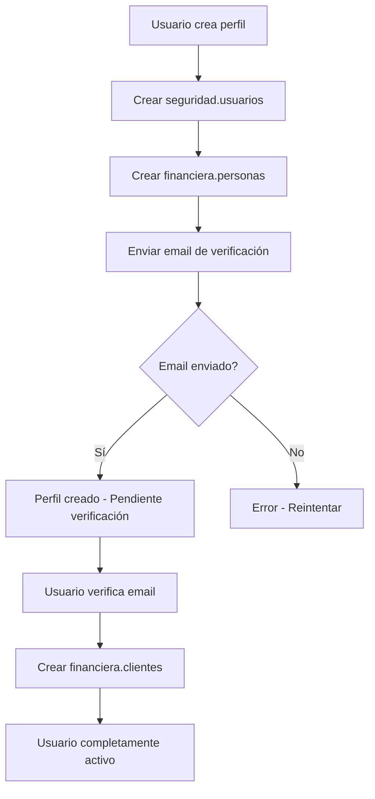

# Arquitectura de Tablas de Usuarios - Zaga

## 📋 **Resumen Ejecutivo**

El sistema de usuarios de Zaga está diseñado con una arquitectura modular que separa las responsabilidades de **autenticación**, **datos personales** y **relación comercial**. Esta separación garantiza seguridad, flexibilidad y cumplimiento legal.

## 🏗️ **Arquitectura General**

```
┌─────────────────────┐    ┌─────────────────────┐    ┌─────────────────────┐
│  seguridad.usuarios │◄──►│ financiera.personas │◄──►│ financiera.clientes │
│   (Autenticación)   │    │  (Datos Personales) │    │ (Relación Comercial)│
└─────────────────────┘    └─────────────────────┘    └─────────────────────┘
```

### **Relaciones:**

- **1:1** `seguridad.usuarios` ↔ `financiera.personas`
- **1:1** `financiera.personas` ↔ `financiera.clientes`

## 📊 **Descripción Detallada de Tablas**

### **1. `seguridad.usuarios` - Sistema de Acceso**

**Propósito:** Gestionar la autenticación, autorización y estado de acceso al sistema.

```sql
CREATE TABLE seguridad.usuarios (
  user_id UUID PRIMARY KEY,           -- Identificador único del usuario
  persona_id UUID UNIQUE,             -- FK a financiera.personas
  rol VARCHAR(20) NOT NULL,           -- 'admin' | 'cliente'
  estado VARCHAR(20) NOT NULL,        -- 'activo' | 'inactivo'
  email_verificado BOOLEAN DEFAULT FALSE,
  email_verificado_at TIMESTAMP,
  created_at TIMESTAMP DEFAULT NOW(),
  updated_at TIMESTAMP DEFAULT NOW()
);
```

**Responsabilidades:**

- ✅ **Autenticación** - Quién puede acceder al sistema
- ✅ **Autorización** - Qué permisos tiene (admin/cliente)
- ✅ **Estado de cuenta** - Activo/inactivo
- ✅ **Verificación de email** - Seguridad y validación
- ✅ **Auditoría** - Registro de creación y modificaciones

**Campos Clave:**

- `user_id`: Identificador único (UUID)
- `persona_id`: Enlace a datos personales
- `rol`: Determina permisos en el sistema
- `estado`: Control de acceso (activo/inactivo)

---

### **2. `financiera.personas` - Datos Personales**

**Propósito:** Almacenar información personal y legal de los usuarios.

```sql
CREATE TABLE financiera.personas (
  id UUID PRIMARY KEY,                -- Identificador único de la persona
  tipo_doc VARCHAR(20) NOT NULL,      -- 'DNI' | 'PASAPORTE' | 'CUIL'
  numero_doc VARCHAR(20) NOT NULL,    -- Número de documento
  nombre VARCHAR(100) NOT NULL,       -- Nombre de pila
  apellido VARCHAR(100) NOT NULL,     -- Apellido
  email VARCHAR(255) UNIQUE NOT NULL, -- Email de contacto
  telefono VARCHAR(20),               -- Teléfono de contacto
  fecha_nac DATE,                     -- Fecha de nacimiento
  created_at TIMESTAMP DEFAULT NOW(),
  updated_at TIMESTAMP DEFAULT NOW(),

  UNIQUE(tipo_doc, numero_doc)        -- DNI único por tipo
);
```

**Responsabilidades:**

- ✅ **Identidad legal** - Datos del documento de identidad
- ✅ **Información personal** - Nombre, apellido, fecha nacimiento
- ✅ **Datos de contacto** - Email y teléfono
- ✅ **Cumplimiento legal** - Datos requeridos por regulaciones argentinas
- ✅ **Validación de identidad** - Verificación de datos únicos

**Campos Clave:**

- `tipo_doc + numero_doc`: Identificación legal única
- `email`: Contacto principal (único)
- `nombre + apellido`: Identidad personal

---

### **3. `financiera.clientes` - Relación Comercial**

**Propósito:** Gestionar la relación comercial entre la empresa y los usuarios.

```sql
CREATE TABLE financiera.clientes (
  id UUID PRIMARY KEY,                -- Identificador único del cliente
  persona_id UUID UNIQUE NOT NULL,    -- FK a financiera.personas
  estado VARCHAR(20) NOT NULL,        -- 'activo' | 'inactivo' | 'suspendido'
  created_at TIMESTAMP DEFAULT NOW(),
  updated_at TIMESTAMP DEFAULT NOW(),

  FOREIGN KEY (persona_id) REFERENCES financiera.personas(id)
);
```

**Responsabilidades:**

- ✅ **Relación comercial** - Cliente de la empresa Zaga
- ✅ **Estado comercial** - Puede ser diferente al estado de usuario
- ✅ **Historial financiero** - Base para préstamos, pagos, transacciones
- ✅ **Separación de responsabilidades** - Usuario vs Cliente
- ✅ **Gestión comercial** - Control de clientes activos/suspendidos

**Campos Clave:**

- `persona_id`: Enlace a datos personales
- `estado`: Estado comercial (independiente del estado de usuario)

## 🔄 **Flujo de Creación de Usuario (Nuevo Flujo Seguro)**

### **🛡️ Principios de Seguridad:**
- ✅ **Email verificado** antes de crear datos financieros
- ✅ **Cliente creado** solo después de verificación
- ✅ **Datos personales** se crean inmediatamente (para identificación)
- ✅ **Datos financieros** se crean solo con email confirmado

### **Paso 1: Crear Usuario de Seguridad**

```javascript
// Crear en seguridad.usuarios
const usuario = await prisma.seguridad_usuarios.create({
  data: {
    user_id: 'uuid-generado',
    rol: 'cliente',
    estado: 'activo',
    email_verificado: false,
  },
});
```

### **Paso 2: Crear Persona (Sin Cliente Aún)**

```javascript
// Crear en financiera.personas
const persona = await prisma.financiera_personas.create({
  data: {
    tipo_doc: 'DNI',
    numero_doc: '12345678',
    nombre: 'Juan',
    apellido: 'Pérez',
    email: 'juan@email.com',
    telefono: '+54911234567',
    fecha_nac: '1990-01-01',
  },
});

// Asociar usuario con persona
await prisma.seguridad_usuarios.update({
  where: { user_id: usuario.user_id },
  data: { persona_id: persona.id },
});
```

### **Paso 3: Enviar Email de Verificación**

```javascript
// Crear token de verificación
const token = await emailVerificationService.createVerificationToken(
  usuario.user_id,
  'email_verification'
);

// Enviar email (OBLIGATORIO - si falla, lanza error)
await emailService.sendVerificationEmail(persona.email, token);
```

### **Paso 4: Verificar Email y Crear Cliente**

```javascript
// Solo después de verificar email
const userId = await emailVerificationService.verifyToken(token, 'email_verification');
await emailVerificationService.markEmailAsVerified(userId);

// AHORA SÍ crear cliente
const cliente = await prisma.financiera_clientes.create({
  data: {
    persona_id: persona.id,
    estado: 'activo',
  },
});
```

### **🔄 Diagrama del Flujo:**



## 🎯 **Ventajas de esta Arquitectura**

### **1. Separación de Responsabilidades**

- **Seguridad** → Control de acceso
- **Personas** → Datos legales/personales
- **Clientes** → Relación comercial

### **2. Flexibilidad**

- **Múltiples roles** por persona
- **Estados independientes** (usuario vs cliente)
- **Futuras funcionalidades** sin afectar seguridad

### **3. Cumplimiento Legal**

- **Datos personales** separados de **datos de acceso**
- **Auditoría** independiente por área
- **GDPR/Protección de datos** más fácil

### **4. Escalabilidad**

- **Múltiples tipos de usuarios** (empleados, proveedores, etc.)
- **Integración** con otros sistemas
- **Crecimiento** del negocio

## 📋 **Casos de Uso Comunes**

### **Caso 1: Usuario Nuevo**

```
1. Crear usuario (seguridad.usuarios)
2. Crear persona (financiera.personas)
3. Asociar usuario-persona
4. Crear cliente (financiera.clientes)
```

### **Caso 2: Suspender Cliente**

```
1. Actualizar estado en financiera.clientes
2. Usuario mantiene acceso (seguridad.usuarios)
3. Persona mantiene datos (financiera.personas)
```

### **Caso 3: Cambiar Rol de Usuario**

```
1. Actualizar rol en seguridad.usuarios
2. Persona y cliente no cambian
3. Permisos se actualizan automáticamente
```

## 🔒 **Consideraciones de Seguridad**

### **Validaciones Implementadas:**

- ✅ **Email único** en `financiera.personas`
- ✅ **DNI único** por tipo de documento
- ✅ **Relación 1:1** entre usuario y persona
- ✅ **Verificación de email** obligatoria
- ✅ **Soft delete** para usuarios

### **Reglas de Negocio:**

- ✅ **1 user_id = 1 persona_id**
- ✅ **1 email = 1 cuenta**
- ✅ **DNI único** por persona
- ✅ **Email verificado** para usar la plataforma

## 📊 **Ejemplo Práctico**

```javascript
// Usuario: María González
seguridad.usuarios: {
  user_id: "123e4567-e89b-12d3-a456-426614174000",
  persona_id: "456e7890-e89b-12d3-a456-426614174001",
  rol: "cliente",
  estado: "activo",
  email_verificado: true,
  email_verificado_at: "2025-01-10T15:30:00Z"
}

financiera.personas: {
  id: "456e7890-e89b-12d3-a456-426614174001",
  tipo_doc: "DNI",
  numero_doc: "87654321",
  nombre: "María",
  apellido: "González",
  email: "maria@email.com",
  telefono: "+54911234567",
  fecha_nac: "1985-05-15"
}

financiera.clientes: {
  id: "789e0123-e89b-12d3-a456-426614174002",
  persona_id: "456e7890-e89b-12d3-a456-426614174001",
  estado: "activo"
}
```

## 🛠️ **Herramientas de Desarrollo**

### **Scripts Disponibles:**

- `cleanup-test-data.js` - Limpia usuario de desarrollo
- `node scripts/cleanup-all-users.js` - Limpia todos los usuarios del sistema
- `check-sendgrid-config.js` - Verifica configuración de SendGrid
- `test-new-user-flow.js` - Prueba el flujo completo de verificación
- `check-all-tables.js` - Verifica estado de tablas

### **Endpoints API (Nuevo Flujo):**

- `POST /usuarios/crear-perfil` - Crear perfil (sin cliente, pendiente verificación)
- `POST /usuarios/verificar-email` - Verificar email y crear cliente
- `POST /usuarios/reenviar-verificacion` - Reenviar email de verificación
- `GET /usuarios/yo` - Obtener perfil del usuario
- `PUT /usuarios/yo` - Actualizar perfil
- `DELETE /usuarios/:id` - Desactivar usuario

## 📝 **Notas Importantes (Nuevo Flujo)**

1. **En desarrollo:** Usar scripts de limpieza entre pruebas
2. **En producción:** Cada usuario real tendrá user_id único
3. **Email:** Debe ser único en toda la plataforma
4. **DNI:** Debe ser único por tipo de documento
5. **Verificación:** Email DEBE ser verificado para crear cliente
6. **Seguridad:** Cliente solo se crea después de verificar email
7. **Error handling:** Si falla el email, el usuario debe reintentar
8. **Auditoría:** Todas las tablas tienen timestamps de creación/modificación

## 🔗 **Relaciones con Otros Sistemas**

### **Futuras Integraciones:**

- **Sistema de Préstamos** → `financiera.clientes`
- **Sistema de Pagos** → `financiera.personas`
- **Sistema de Notificaciones** → `financiera.personas.email`
- **Sistema de Auditoría** → `seguridad.usuarios`
- **Sistema de Reportes** → Todas las tablas

---

**Documento creado:** 2025-01-10  
**Versión:** 1.0  
**Autor:** Sistema Zaga - NextLab
