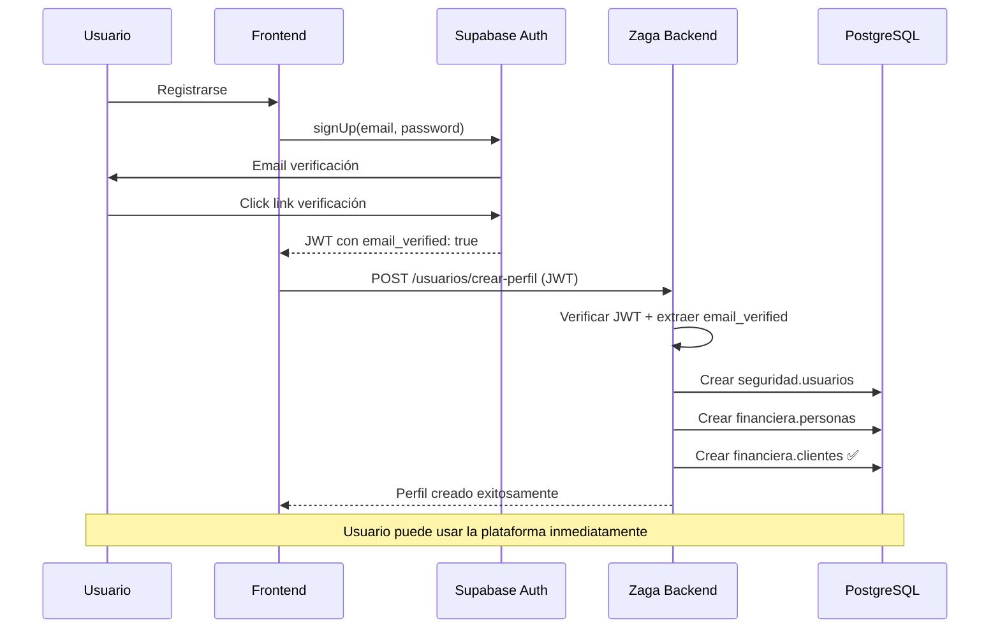

# Flujo de Autenticación con Supabase

## 📋 **Resumen Ejecutivo**

El sistema de autenticación de Zaga utiliza **Supabase Auth** como única fuente de verdad para la verificación de email y autenticación de usuarios. El backend confía en la verificación realizada por Supabase y crea los perfiles de usuario inmediatamente.

## 🔄 **Flujo Completo**

### **1. Registro de Usuario (Frontend + Supabase)**

```typescript
// Frontend
const { data, error } = await supabase.auth.signUp({
  email: 'usuario@example.com',
  password: 'password123',
  options: {
    emailRedirectTo: 'https://zaga.com.ar/dashboard',
  },
});

// Supabase envía email de verificación automáticamente ✅
// Usuario hace click en link de verificación
// Email verificado por Supabase ✅
```

### **2. Login y Obtención de JWT**

```typescript
// Frontend
const { data, error } = await supabase.auth.signInWithPassword({
  email: 'usuario@example.com',
  password: 'password123',
});

// JWT contiene:
// {
//   sub: "user-uuid",
//   email: "usuario@example.com",
//   email_verified: true, // ✅ Verificado por Supabase
//   user_metadata: { rol: "cliente" }
// }
```

### **3. Crear Perfil (Backend)**

```typescript
// POST /usuarios/crear-perfil (con JWT en Authorization header)
// Backend extrae email_verified del JWT
// Crea: usuario + persona + cliente inmediatamente

const result = await fetch('/usuarios/crear-perfil', {
  method: 'POST',
  headers: {
    Authorization: `Bearer ${jwt}`,
    'Content-Type': 'application/json',
  },
  body: JSON.stringify({
    tipo_doc: 'DNI',
    numero_doc: '12345678',
    nombre: 'Juan',
    apellido: 'Pérez',
    email: 'usuario@example.com',
    telefono: '+54911234567',
    fecha_nac: '1990-01-01',
  }),
});
```

### **4. Respuesta del Backend**

```json
{
  "success": true,
  "message": "Perfil creado exitosamente. Ya puedes usar la plataforma.",
  "data": {
    "persona_id": "uuid-persona",
    "nombre": "Juan",
    "apellido": "Pérez",
    "email_verificado": true
  }
}
```

## 🎯 **Estados del Usuario**

| Estado              | Supabase Auth     | seguridad.usuarios | financiera.personas    | financiera.clientes | Puede Operar |
| ------------------- | ----------------- | ------------------ | ---------------------- | ------------------- | ------------ |
| **Registrado**      | ✅ email_verified | ❌                 | ❌                     | ❌                  | ❌           |
| **Perfil Básico**   | ✅                | ✅                 | ✅ (nombre, DNI)       | ✅                  | ✅           |
| **Perfil Completo** | ✅                | ✅                 | ✅ (+ fecha_nac, docs) | ✅                  | ✅           |

## 🔧 **Configuración Requerida**

### **Variables de Entorno:**

```env
# Supabase (REQUERIDO)
SUPABASE_PROJECT_URL=https://<project-id>.supabase.co
SUPABASE_JWKS_URL=https://<project-id>.supabase.co/auth/v1/keys
SUPABASE_ANON_KEY=your_anon_key_here
SUPABASE_SERVICE_ROLE_KEY=your_service_role_key_here

# SendGrid (solo para notificaciones transaccionales)
SENDGRID_API_KEY=your_sendgrid_api_key_here
FROM_EMAIL=noreply@zaga.com.ar
FROM_NAME=Zaga
```

### **Configuración de Supabase:**

1. **Habilitar email verification** en Authentication settings
2. **Configurar redirect URLs** para verificación
3. **Configurar JWT settings** con expiración apropiada

## 🛡️ **Seguridad**

### **Fortalezas:**

- ✅ **Verificación única** por Supabase (no duplicada)
- ✅ **JWT con JWKS** para validación robusta
- ✅ **Email verificado** antes de crear perfil
- ✅ **RLS automático** basado en JWT
- ✅ **Tokens seguros** con expiración

### **Consideraciones:**

- ⚠️ **Cambio de email** requiere actualización manual en Supabase
- ⚠️ **Admin creado manualmente** en Supabase Dashboard
- ⚠️ **Dependencia de Supabase** para autenticación

## 📊 **Flujo de Datos**



## 🧪 **Testing**

### **Flujo de Pruebas:**

1. **Registro en Supabase:**

   ```typescript
   const { data } = await supabase.auth.signUp({
     email: 'test@example.com',
     password: 'password123',
   });
   ```

2. **Verificar email** (manual o automático en testing)

3. **Login:**

   ```typescript
   const { data } = await supabase.auth.signInWithPassword({
     email: 'test@example.com',
     password: 'password123',
   });
   ```

4. **Crear perfil:**

   ```typescript
   const response = await fetch('/usuarios/crear-perfil', {
     method: 'POST',
     headers: {
       Authorization: `Bearer ${data.session.access_token}`,
       'Content-Type': 'application/json',
     },
     body: JSON.stringify(mockPerfilDto),
   });
   ```

5. **Verificar** que se creó usuario + persona + cliente

## 🚨 **Manejo de Errores**

### **Errores Comunes:**

1. **JWT inválido o expirado:**

   ```json
   {
     "statusCode": 401,
     "message": "Token inválido o expirado"
   }
   ```

2. **Email no verificado:**
   - El JWT debe contener `email_verified: true`
   - Si es `false`, el usuario debe verificar en Supabase

3. **Perfil ya existe:**

   ```json
   {
     "statusCode": 409,
     "message": "El usuario ya tiene un perfil creado"
   }
   ```

4. **DNI duplicado:**
   ```json
   {
     "statusCode": 409,
     "message": "Ya existe una persona con DNI número 12345678"
   }
   ```

## 📝 **Notas de Implementación**

1. **En desarrollo:** El guard permite bypass si no hay configuración de Supabase
2. **En producción:** JWT debe ser válido y verificado con JWKS
3. **Email verification:** Solo se maneja en Supabase, no en backend
4. **SendGrid:** Solo para notificaciones transaccionales futuras
5. **Admin users:** Creados manualmente en Supabase Dashboard

## 🔗 **Endpoints Relacionados**

- `POST /usuarios/crear-perfil` - Crear perfil (requiere JWT válido)
- `GET /usuarios/yo` - Obtener perfil del usuario
- `PUT /usuarios/yo` - Actualizar perfil
- `PUT /usuarios/:id/cambiar-email` - Cambiar email (admin)

## 📈 **Beneficios del Nuevo Flujo**

### **1. Simplicidad**

- ✅ Un solo sistema de verificación (Supabase)
- ✅ Flujo más directo y comprensible
- ✅ Menos código que mantener

### **2. Seguridad**

- ✅ Verificación robusta por Supabase
- ✅ JWT con JWKS para validación
- ✅ No duplicación de lógica de verificación

### **3. Escalabilidad**

- ✅ Supabase maneja la escalabilidad de auth
- ✅ Backend se enfoca en lógica de negocio
- ✅ Fácil integración con otros servicios

### **4. Mantenibilidad**

- ✅ Menos servicios que mantener
- ✅ Lógica de auth centralizada
- ✅ Fácil testing y debugging

---

**Documento creado:** 2025-01-10  
**Versión:** 1.0  
**Autor:** Sistema Zaga - NextLab
