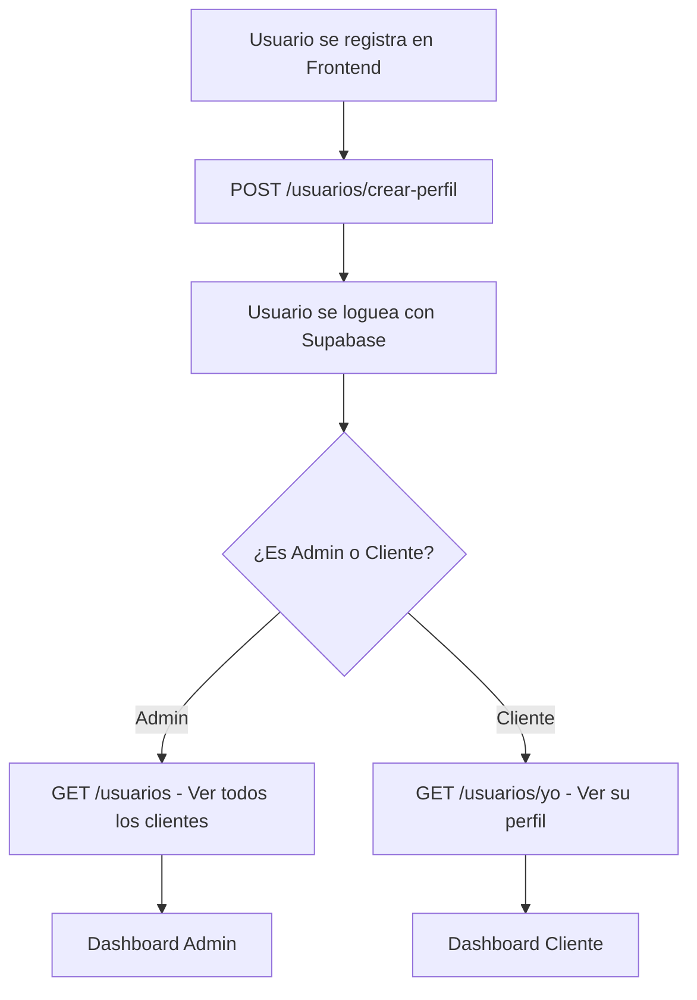

# 🚀 Plan de Desarrollo Gradual - Zaga Backend

## 📊 Análisis del Proyecto Actual

### ✅ **Fortalezas del Backend Existente**
- **Arquitectura sólida**: NestJS 10 + TypeScript + Prisma ORM
- **Seguridad robusta**: JWT con Supabase + RLS (Row Level Security)
- **Escalabilidad**: Redis, BullMQ para procesamiento asíncrono
- **Auditoría completa**: Sistema de trazabilidad con metadatos
- **Modularidad**: 9 módulos bien estructurados
- **Base de datos compleja**: 12 tablas con relaciones financieras
- **Documentación**: Swagger/OpenAPI integrado
- **Testing**: Jest configurado para unitarios y e2e

### ⚠️ **Complejidad Actual**
- **9 módulos** (clientes, solicitudes, préstamos, pagos, evaluaciones, etc.)
- **12 tablas** en la base de datos
- **Sistema de roles complejo** (admin, analista, cobranzas, cliente)
- **Integración BCRA/AFIP** para consultas crediticias
- **Sistema de colas** para procesamiento asíncrono

### 🎯 **Cambio Propuesto: Simplificación de Roles**
**Eliminar roles innecesarios:**
- ❌ `analista` - Funcionalidad se integra en `admin`
- ❌ `cobranzas` - Funcionalidad se integra en `admin`
- ✅ `admin` - Acceso completo al sistema
- ✅ `cliente` - Solo sus propios datos (RLS aplicado)

## 🛠️ Plan de Desarrollo Gradual

### **Fase 1: MVP de Autenticación (Semanas 1-2)**

#### **Objetivo**
Implementar solo la autenticación básica con Supabase y un dashboard mínimo.

#### **Módulos Necesarios**
```typescript
// app.module.ts - Solo estos módulos:
- ConfigModule (ya existe)
- LoggerModule (ya existe) 
- AuthModule (ya existe)
- PrismaModule (ya existe)
- RedisModule (ya existe)
- SaludModule (ya existe)
- UsuariosModule (simplificado)
```

#### **Base de Datos Mínima**
```sql
-- Solo estas tablas necesarias:
- seguridad.usuarios (user_id, persona_id, rol, estado)
- financiera.personas (datos básicos del usuario)
- financiera.auditoria (logs básicos)
```

#### **Endpoints Básicos**
```bash
GET  /salud                    # Health check
GET  /usuarios                 # Listar usuarios (admin) - Dashboard admin
GET  /usuarios/yo             # Perfil del usuario autenticado
POST /usuarios/crear-perfil   # Crear perfil al registrarse (cliente)
```

#### **Flujo de Usuario en Fase 1**


#### **Tareas Específicas**
- [ ] Simplificar `roles.guard.ts` (solo admin/cliente)
- [ ] Crear `UsuariosModule` básico
- [ ] Implementar endpoint `GET /usuarios` (solo admin)
- [ ] Implementar endpoint `GET /usuarios/yo` (cliente/admin)
- [ ] Implementar endpoint `POST /usuarios/crear-perfil` (registro)
- [ ] Configurar RLS básico en Supabase
- [ ] Crear migración de base de datos simplificada

### **Fase 2: Gestión de Clientes (Semanas 3-4)**

#### **Objetivo**
Permitir que los clientes gestionen su información básica.

#### **Módulos Agregados**
```typescript
- ClientesModule (simplificado)
```

#### **Base de Datos**
```sql
-- Agregar:
- financiera.clientes
- financiera.documentos_identidad (básico)
```

#### **Endpoints**
```bash
GET    /clientes/yo           # Mis datos como cliente
PUT    /clientes/yo           # Actualizar mis datos
POST   /clientes/documentos   # Subir documento de identidad
GET    /clientes/documentos   # Ver mis documentos
```

#### **Tareas Específicas**
- [ ] Implementar `ClientesController` básico
- [ ] Crear DTOs para actualización de perfil
- [ ] Implementar subida de documentos
- [ ] Configurar políticas RLS para clientes

### **Fase 3: Solicitudes de Préstamos (Semanas 5-6)**

#### **Objetivo**
Permitir que los clientes soliciten préstamos y los admins los gestionen.

#### **Módulos Agregados**
```typescript
- SolicitudesModule
- GarantesModule (básico)
```

#### **Base de Datos**
```sql
-- Agregar:
- financiera.solicitudes
- financiera.garantes
- financiera.solicitud_garantes
```

#### **Endpoints Cliente**
```bash
POST   /solicitudes           # Crear solicitud
GET    /solicitudes           # Ver mis solicitudes
GET    /solicitudes/:id       # Ver detalle de solicitud
POST   /solicitudes/:id/garantes # Agregar garante
```

#### **Endpoints Admin**
```bash
GET    /admin/solicitudes     # Ver todas las solicitudes
PUT    /admin/solicitudes/:id # Actualizar estado
GET    /admin/solicitudes/:id # Ver detalle completo
```

### **Fase 4: Evaluaciones y Préstamos (Semanas 7-8)**

#### **Objetivo**
Implementar el proceso de evaluación y aprobación de préstamos.

#### **Módulos Agregados**
```typescript
- EvaluacionesModule
- PrestamosModule
```

#### **Base de Datos**
```sql
-- Agregar:
- financiera.evaluaciones
- financiera.prestamos
- financiera.cronogramas
```

#### **Endpoints Admin**
```bash
POST   /admin/solicitudes/:id/evaluar    # Iniciar evaluación
PUT    /admin/evaluaciones/:id           # Actualizar evaluación
POST   /admin/solicitudes/:id/aprobar    # Aprobar préstamo
GET    /admin/prestamos                  # Ver todos los préstamos
```

#### **Endpoints Cliente**
```bash
GET    /prestamos                        # Ver mis préstamos
GET    /prestamos/:id                    # Ver detalle de préstamo
GET    /prestamos/:id/cronograma         # Ver cronograma de pagos
```

### **Fase 5: Sistema de Pagos (Semanas 9-10)**

#### **Objetivo**
Implementar el sistema de pagos y seguimiento.

#### **Módulos Agregados**
```typescript
- PagosModule
```

#### **Base de Datos**
```sql
-- Agregar:
- financiera.pagos
```

#### **Endpoints**
```bash
# Cliente
GET    /pagos                           # Ver mis pagos
POST   /pagos                           # Registrar pago

# Admin
GET    /admin/pagos                     # Ver todos los pagos
PUT    /admin/pagos/:id                 # Actualizar estado de pago
```

### **Fase 6: Funcionalidades Avanzadas (Semanas 11-12)**

#### **Objetivo**
Agregar funcionalidades avanzadas según necesidad.

#### **Módulos Opcionales**
```typescript
- FuentesExternasModule (BCRA/AFIP)
- JobsModule (procesamiento asíncrono)
- VerificacionIdentidadModule (avanzado)
```

## 🔧 **Modificaciones Necesarias en el Código Actual**

### **1. Simplificar Sistema de Roles**

#### **Archivo: `src/config/roles.decorator.ts`**
```typescript
// Cambiar de:
export const Roles = (...roles: string[]) => SetMetadata('roles', roles);

// A:
export const Roles = (...roles: ('admin' | 'cliente')[]) => SetMetadata('roles', roles);
```

#### **Archivo: `src/config/roles.guard.ts`**
```typescript
// Simplificar validación para solo admin/cliente
const validRoles = ['admin', 'cliente'];
```

### **2. Actualizar Base de Datos**

#### **Archivo: `prisma/schema.prisma`**
```prisma
// Simplificar tabla de usuarios
model seguridad_usuarios {
  user_id     String   @id @db.Uuid
  persona_id  String?  @db.Uuid
  rol         String   @default("cliente") // Solo "admin" o "cliente"
  estado      String   @default("activo")
  created_at  DateTime @default(now()) @db.Timestamptz(6)
  updated_at  DateTime @updatedAt @db.Timestamptz(6)

  @@map("seguridad.usuarios")
}
```

### **3. Simplificar App Module**

#### **Archivo: `src/app.module.ts`**
```typescript
@Module({
  imports: [
    // Configuración básica
    ConfigModule.forRoot({...}),
    LoggerModule.forRootAsync({...}),
    
    // Servicios compartidos
    AuthModule,
    PrismaModule,
    RedisModule,
    
    // Módulos básicos
    SaludModule,
    UsuariosModule, // Nuevo módulo simplificado
    
    // Módulos adicionales se agregan gradualmente
    // ClientesModule,    // Fase 2
    // SolicitudesModule, // Fase 3
    // etc...
  ],
})
export class AppModule {}
```

## 📋 **Checklist de Implementación**

### **Preparación (Día 1)**
- [ ] Crear rama `feature/simplified-roles`
- [ ] Actualizar documentación de roles
- [ ] Crear migración para simplificar roles
- [ ] Actualizar tests existentes

### **Fase 1 - MVP (Semanas 1-2)**
- [ ] Simplificar `roles.guard.ts`
- [ ] Crear `UsuariosModule` básico
- [ ] Implementar endpoint `/usuarios/yo`
- [ ] Configurar RLS en Supabase
- [ ] Crear tests básicos
- [ ] Documentar API con Swagger

### **Fase 2 - Clientes (Semanas 3-4)**
- [ ] Implementar `ClientesModule`
- [ ] Crear DTOs para perfil de cliente
- [ ] Implementar subida de documentos
- [ ] Configurar políticas RLS
- [ ] Tests de integración

### **Fase 3 - Solicitudes (Semanas 5-6)**
- [ ] Implementar `SolicitudesModule`
- [ ] Crear `GarantesModule` básico
- [ ] Implementar endpoints de cliente
- [ ] Implementar endpoints de admin
- [ ] Tests end-to-end

### **Fase 4 - Préstamos (Semanas 7-8)**
- [ ] Implementar `EvaluacionesModule`
- [ ] Implementar `PrestamosModule`
- [ ] Crear sistema de cronogramas
- [ ] Implementar aprobación de préstamos
- [ ] Tests de flujo completo

### **Fase 5 - Pagos (Semanas 9-10)**
- [ ] Implementar `PagosModule`
- [ ] Crear sistema de seguimiento
- [ ] Implementar notificaciones básicas
- [ ] Tests de pagos

### **Fase 6 - Avanzado (Semanas 11-12)**
- [ ] Evaluar necesidad de módulos avanzados
- [ ] Implementar según prioridades
- [ ] Optimización y performance
- [ ] Documentación final

## 🎯 **Ventajas del Plan Gradual**

### **Para el Aprendizaje**
- ✅ **Progresión natural**: Cada fase construye sobre la anterior
- ✅ **Comprensión profunda**: Entiendes cada pieza antes de agregar complejidad
- ✅ **Debugging más fácil**: Problemas más localizados y manejables

### **Para el Desarrollo**
- ✅ **Desarrollo más rápido**: Menos código = menos bugs
- ✅ **Feedback temprano**: Puedes probar funcionalidades básicas rápidamente
- ✅ **Flexibilidad**: Puedes ajustar el plan según necesidades reales

### **Para el Negocio**
- ✅ **Menor costo inicial**: Menos recursos de infraestructura
- ✅ **Time-to-market**: Funcionalidades básicas disponibles antes
- ✅ **Escalabilidad real**: Agregas funcionalidades según demanda real

## 🚀 **Próximos Pasos**

1. **Crear rama de desarrollo**: `git checkout -b feature/simplified-roles`
2. **Simplificar sistema de roles** según especificaciones
3. **Implementar Fase 1** (MVP de autenticación)
4. **Crear frontend básico** para probar autenticación
5. **Iterar** según el plan gradual

---

**Nota**: Este plan mantiene la arquitectura sólida del proyecto actual pero simplifica la complejidad inicial, permitiendo un desarrollo más manejable y un aprendizaje progresivo.
